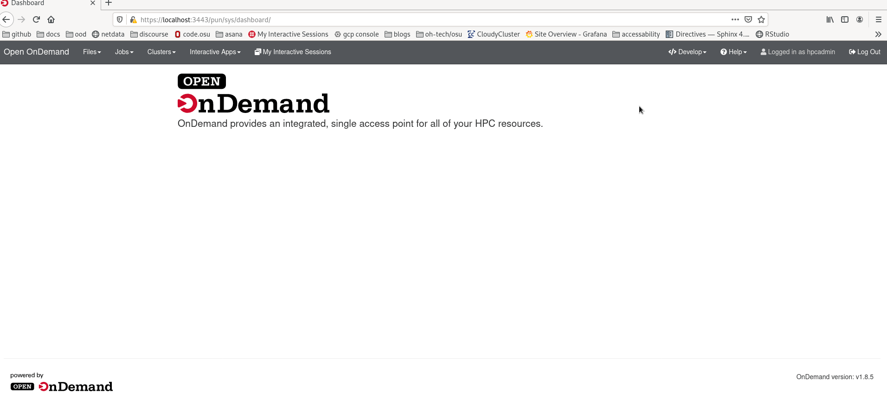
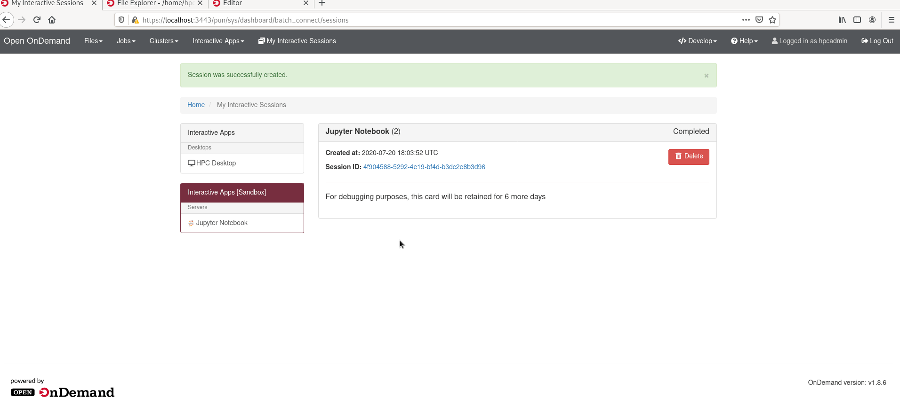
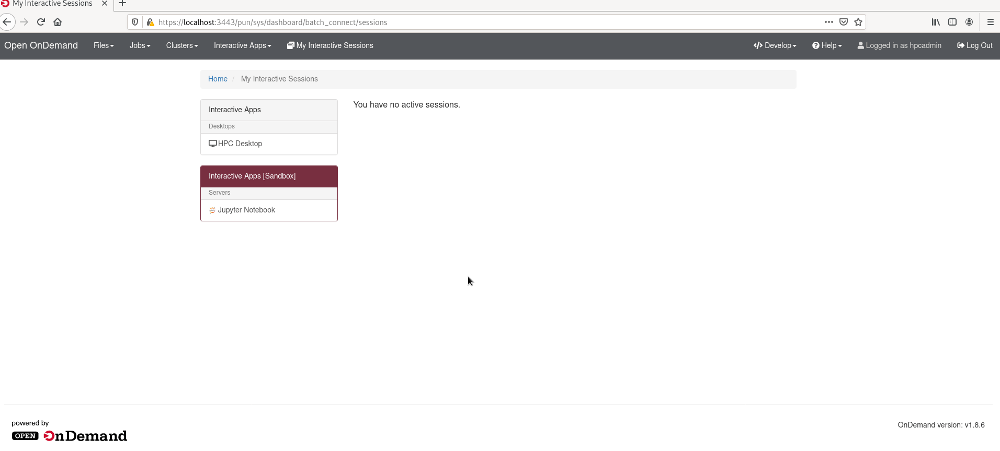
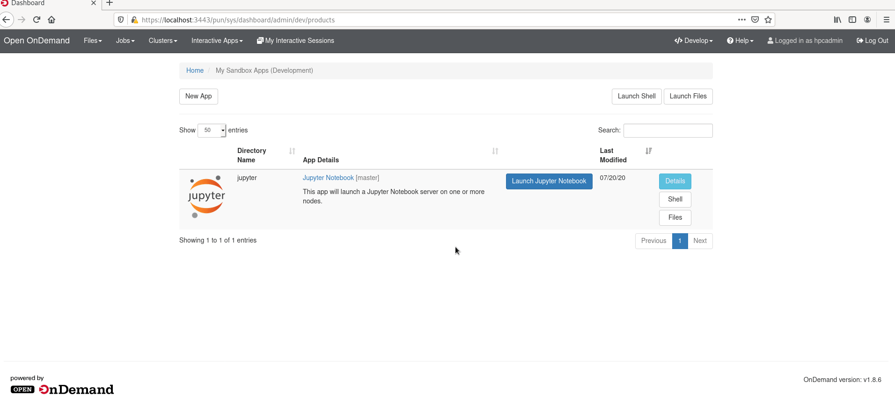

# Extending OOD With Initializers

## Table of Contents

Live tutorial steps as created for the Global OOD Conference 2025

- [Base OOD Tutorial](../../../../ubccr/hpc-toolset-tutorial/tree/master/ondemand)
- [Fixing the Jupyter App](#fixing-jupyter)
- [Getting User Information](#getting-user-info)
- [Canceling Jobs](#canceling-jobs)
- [Getting Cluster or System Information](#getting-cluster-info)
- [There's More?](#initializers-more)

This tutorial will be using the the `hpcadmin` credentials listed in
[Accessing the Applications](../../../../ubccr/hpc-toolset-tutorial/tree/master/docs/applications.md)

## External links

- [Online Documentation](https://osc.github.io/ood-documentation/master/)

## Fixing Jupyter

You may have noticed the jupyter tutorial doesn't work right. We're gonna take a beat and fix it. Keeping in the tutorial instructions
<details>
  <summary>Click to open or close tutorial details.</summary>

<br>

- [Initializing the developer application.](#create-the-jupyter-application)
- [Debugging the app and getting it to run correctly.](#get-jupyter-working)
- [Changing the type of a form option.](#change-bc_queue-to-a-select-field)
- [Adding limits for form options.](#limit-bc_num_slots)
- [Adding new form options.](#adding-a-jupyterlab-checkbox)
- [Using native scheduler arguements](#using-script-native-attributes)
- [Explanations of the form.yml file.](#a-closer-look-at-the-formyml)
- [Editing the manifest.yml](#edit-the-manifest).
- [Promoting the application to production.](#deploying-to-production)                                

### Create the jupyter application

Click on "My Sandbox Apps (Development)" from the dropdown menu "Develop" in the navigation bar
to navigate to the sandbox app workspace.

Now create a new app from the button labeled "New App".

This will bring you to a page where you'll click "Clone Existing App" which will bring you to
this form to fill out.

Fill in `jupyter` as the directory name. `/var/git/bc_example_jupyter` as the Git Remote and
check "Create a new Git Project from this?".  Then click "Submit" to create a new development
application.

This copied what was in `/var/git/bc_example_jupyter` to `/home/hpcadmin/ondemand/dev/jupyter`.
You can navigate to these files [through the Files app with this link](https://localhost:3443/pun/sys/files/fs/home/hpcadmin/ondemand/dev/jupyter/)
or simply Press the "Files" button in Jupyter's row of the sandbox applications table.



You'll also need to setup `git` for the hpcadmin user at this point, so let's go ahead and do that
and make first commit to the jupyter app as the starting point.

```shell
git config --global user.email hpcadmin@localhost
git config --global user.name "HPC Admin"
cd ~/ondemand/dev/jupyter
git add .
git commit -m 'starting point'
```

### Get Jupyter Working

#### Configure the correct cluster

The example application we've created does not use the correct cluster configuration, so we've got
to modify it.

If you try to submit it as is, you'll get this error:


We need to edit the `form.yml` in the appication's folder. We can navigate to the folder through the
files app.  The URL is `https://localhost:3443/pun/sys/files/fs/home/hpcadmin/ondemand/dev/jupyter/`.

Here you'll see the `form.yml` file. We can edit it by clicking on the file and pressing the "Edit"
button.  This will take us to the [file editor app, with this file open](https://localhost:3443/pun/sys/file-editor/edit/home/hpcadmin/ondemand/dev/jupyter/form.yml)

In the file Editor, specify `hpc` as the cluster attribute on line 11 like so: `cluster: "hpc"`. Save this file by clicking
the "Save" button at the top left.

#### Launch the Jupyter Application

Now when we navigate back to our [interactive sessions](https://localhost:3443/pun/sys/dashboard/batch_connect/sessions),
you'll see the "Interactive Apps \[Sandbox\]" menu with an item labeled "Jupyter Notebook".

[Follow this link](https://localhost:3443/pun/sys/dashboard/batch_connect/dev/jupyter/session_contexts/new) and we'll be
presented with this form for specifying different attributes about the job we want to submit to the SLURM scheduler.

We don't need to change anything in this form, so simply press "Launch" at the bottom of the form. After pressing
launch the job should have successfully launched the job and redirected us back
the [interactive sessions](https://localhost:3443/pun/sys/dashboard/batch_connect/sessions) page where we'll
see a panel showing our job.


#### Debug failure

This job is going to run and fail during startup.  But don't worry! We're going to debug and fix it.

When the job completes, the panel still exists, so you can follow the link in the panel to the log
directory of the job.

Follow the link and we'll be redirected to the job's working directory where an `output.log` file is.
Let's open that file with the "View" button.

When you open the log file, you'll see the something like this where it says **jupyter: command not found**.
So you can see, we have `PATH` issues.

```shell
TIMING - Starting jupyter at: Fri Jul 17 18:06:34 UTC 2020
+ jupyter notebook --config=/home/hpcadmin/ondemand/data/sys/dashboard/batch_connect/dev/jupyter/output/e16b9a77-1a4f-4c9e-95f3-d3c23e5e8d76/config.py
/home/hpcadmin/ondemand/data/sys/dashboard/batch_connect/dev/jupyter/output/e16b9a77-1a4f-4c9e-95f3-d3c23e5e8d76/script.sh: line 27: jupyter: command not found
Timed out waiting for Jupyter Notebook server to open port 16970!
```

#### Configure jupyter PATH

So we know what the issue is, the job's script can't find the `jupyter` executable in the `PATH`.

Jupyter was installed in these containers through Python's virtual environment and that's
why it's not directly in the shell scripts `PATH`.

We need to add this line to our job's shell script to enable it.

```shell
source /usr/local/jupyter/4.3.5/bin/activate
```

So let's [open the template/script.sh.erb in the file editor](https://localhost:3443/pun/sys/file-editor/edit/home/hpcadmin/ondemand/dev/jupyter/template/script.sh.erb)
and add this to line 27 of the shell script, just before we start jupyter.

Lines 24 - 31 of `template/script.sh.erb` should now look like this.

```shell
# Benchmark info
echo "TIMING - Starting jupyter at: $(date)"

source /usr/local/jupyter/4.3.5/bin/activate

# Launch the Jupyter Notebook Server
set -x
jupyter notebook --config="${CONFIG_FILE}" <%= context.extra_jupyter_args %>
```

### Why's it still broken?

You'll notice the job still doesn't start, but goes straight to completed. If you click the session ID, and view the output.log, you'll see [a LOT of info](imgs/jupyter-output-log-errors.png)

There's a slight issue with jupyter. The syntax for opening notebook vs lab has been changed, with some pretty specific intents moving forward. Lab is now the expected default, because it provides more functionality, while still having the typical notebook behavior. And the module command isn't needed either in the script, so we'll take this opportunity to fix multiple issues.

Open the `template/script.sh.erb` file from the file editor app, and remove the lines with "module" and change the final line to be 

```shell
jupyter lab --config="${CONFIG_FILE}" <%= context.extra_jupyter_args %>
```

#### Correctly launch

Now we can [launch the application again](https://localhost:3443/pun/sys/dashboard/batch_connect/dev/jupyter/session_contexts/new) and it should work.

When it is up and running and available to use the panel will show a "Connect to Jupyter" button.  Click this button
and OnDemand will redirect us to Jupyter.



Congratulations! We've now started development on the Jupyter Notebook batch connect application and
successfully connected to it.

You may want to delete this job now by using the "Delete" button on the panels as we'll be iterating through
developing the application and starting new jobs.

#### Save your spot

Now it's probably a good idea to save the modifications. They're small, but it'll still help if you
ever get into trouble and need to revert. A simplified version of the `form.yml` is in the very next
section, and you may want to use and save _it_ instead so that any `git diff` you do will be much
smaller and easier to read.

You can use the
[shell app to login to this directory](https://localhost:3443/pun/sys/shell/ssh/ondemand/home/hpcadmin/ondemand/dev/jupyter/)

In this shell you'll save in git with these commands:

```shell
git add .
git commit -m 'initial commit that correctly submits to the hpc cluster'
```



### A closer look at the form.yml

The items in the form.yml directly create what's shown to the users in the form they interact with.
Let's take a closer look at the `form.yml` that created the form you just submitted to get an
understanding of how they relate to what's shown in the UI.

This is the `form.yml` you should have at this point without all the comments.

```yaml
cluster: "hpc"
attributes:
  modules: "python"
  extra_jupyter_args: ""
form:
  - modules
  - extra_jupyter_args
  - bc_account
  - bc_queue
  - bc_num_hours
  - bc_num_slots
  - bc_email_on_started
```

All fields pre-pended with `bc_` are special fields OnDemand provides for convenience. They are commonly
used fields that create corresponding script attribute.  We'll talk more about script attributes later.

* `modules` Specifies the modules loaded. Since it's hard coded to "python" (in the attributes)
    we didn't see it in the form.
* `extra_jupyter_args` Specifies the extra jupyter arguments but since it's hard coded to "" we didn't
    didn't see it in the form.
* `bc_account` Creates the "Account" text field and submits the job with the given account.
* `bc_queue` Creates the "Partition" text field and submits the job to the given partition.
* `bc_num_hours` Creates the "Number of hours" integer field and submits the job with the given
    walltime.
* `bc_num_slots` Creates the "Number of nodes" integer field and submits the job with the requested
    cores.
* `bc_email_on_started` Creates the "I would like to receive an email when the session starts" checkbox
    and submits the job with a request to email when the job starts.

### Updating the Jupyter App

#### Change bc_queue to a select field

We have 2 partitions enabled in the SLURM containers (SLURM calls queues partitions, so we'll be switching
back and forth between the two terms in this tutorial). We've started with a field `bc_queue` that
is a text field, but it's likely much easier for users to simply choose the partition out of a
select dropdown menu instead.

So let's replace the `bc_queue` field in the form with a new field that we'll call `custom_queue`.

We'll also add `custom_queue` to the attributes section.  Adding a field to the form section adds it to the form
in the UI.  By default, this field will be a text field. If you want this field to be a different type of widget
(as we do) you'll configure the field in the attributes section.  Also by default the label in the UI is the
same just the name of the field. In our case `custom_queue` would turn into "Custom Queue".  This is only
slightly correct, so we want to specify the label as "Partition" because that's what it is in SLURM parlance.Here you can see that we specify the `custom_queue` in the attributes as a select widget with two options.
and a new label. The first element in options arrays is what will be shown to the user (the capitalized version)
where the second element is the value what's actually used in the sbatch command.

```yaml
# form.yml, with only this addition for brevity
attributes:
  custom_queue:
    widget: "select"
    label: "Partition"
    options:
      - ["Compute", "compute"]
      - ["Debug", "debug"]
form:
  - custom_queue
#   - bc_queue
```

Refresh the [new session form](https://localhost:3443/pun/sys/dashboard/batch_connect/dev/jupyter/session_contexts/new)
and you should now see your updates.

But before we submit to test them out, we'll need to reconfigure the `submit.yml.erb` to use this
new field.  You can
[edit the submit.yml.erb in the file editor app](https://localhost:3443/pun/sys/file-editor/edit/home/hpcadmin/ondemand/dev/jupyter/submit.yml.erb).

You'll need to specify the script's queue_name as the partition like so. The `script` is the logical
"script" we're submitting to the scheduler.  And the `queue_name` is the field of the script that will
specify the queue. (OnDemand knows how to translate it from queue_name into partition for SLURM).

```yaml
script:
  queue_name: "<%= custom_queue %>"
```

The .erb file extension indicates this is embedded ruby file. This means that Ruby will template this file
and turn it into a yml file that OnDemand will then read.  `<%=` and `%>` are embedded ruby tags to turn the
variable (or expression) into a string. Anything we've defined in the `form.yml` can be used in this ERB file.
In this example we just defined `custom_queue` in the form so we can use it directly here.

If you're not super comfortable with the terminology just remember this: `custom_queue` is defined in the `form.yml`
(the file that defines what the UI form looks like) so it can be used in the `submit.yml.erb` (the file
that is used to configure the job that is being submitted) as `<%= custom_queue %>`.

When [launch the application again](https://localhost:3443/pun/sys/dashboard/batch_connect/dev/jupyter/session_contexts/new)
you can [login to a shell](#get-a-shell-session) and confirm you chose a different queue with this command.
```shell
[hpcadmin@ondemand ~]$ squeue -o "%j %P"
NAME PARTITION
sys/dashboard/dev/jupyter debug
```


At this point, this should be the entirety of the `submit.yml.erb` and `form.yml` (without comments).
They're given here in full if you want to copy/paste them. And remember to [save your spot](#save-your-spot)!

```yaml
# submit.yml.erb
script:
  queue_name: "<%= custom_queue %>"
```

```yaml
# form.yml
cluster: "hpc"
attributes:
  modules: "python"
  extra_jupyter_args: ""
  custom_queue:
    widget: "select"
    label: "Partition"
    options:
      - ["Compute", "compute"]
      - ["Debug", "debug"]
form:
  - modules
  - extra_jupyter_args
  - bc_account
  - custom_queue
  - bc_num_hours
  - bc_num_slots
  - bc_email_on_started
```

#### Limit bc_num_slots

SLURM is configured with only 2 nodes total.  If you were now to submit this app
with say 3 or more `bc_num_slots` it would sit in the queue forever because SLURM
cannot find a suitable host to run it on.

So, let's limit this field to a max of 2.

```yaml
# form.yml
attributes:
  bc_num_slots:
    max: 2
```

That's it! Again, because `bc_num_slots` is convenience field, it already has a minimum of 1
that you can't override, because it doesn't make sense to specify 0 or less nodes.

#### Using script native attributes

`script.native` attributes are way for us to specify _any_ arguments to the schedulers that
we can't pre-define or have a good generic definition like `queue_name` above.

In this section we're going to put make OnDemand request memory through the sbatch's
`--mem` argument.

First, let's add it to the form like so.

Here are descriptions of all the fields we'll apply to it.  Note if the label was not
not defined the default 'Memory' would have been OK.  Also we don't really need the
the help message here, it was really just for illustration.

* `widget` specifies the type of widget to be a number
* `max` the maximum value, ~1 GB in this case
* `min` the minimum value, 200 MB
* `step` the step size when users increase or decrease the value
* `value` the default value of 600 MB
* `label` the for UIs label
* `help` a help message

```yaml
# form.yml, with only this addition for brevity
attributes:
  memory:
    widget: "number_field"
    max: 1000
    min: 200
    step: 200
    value: 600
    label: "Memory (MB)"
    help: "RSS Memory"
form:
  - memory
```

Again, now to actually use the value we populate in the form, we need to use
it in the `submit.yml.erb`.  This is where `script.native` attributes come in.

```yaml
# submit.yml.erb
script:
  native:
    - "--mem"
    - "<%= memory %>M"
```

Native attributes are an array and they're passed to the schedule just as they're
defined here.

This would translate into a command much like: `sbatch --mem 800M`.  As you can see
native allows us to pass _anything_ we wish into the scheduler command.

To confirm your job is running with the correct memory parameters, simply
[login to a shell](#get-a-shell-session) and run the command below. You should see output like this.

```shell
[hpcadmin@ondemand /]$ squeue -o "%j %m"
NAME MIN_MEMORY
sys/dashboard/dev/jupyter 800M
```

At this point, this should be the entirety of the `submit.yml.erb` and `form.yml` (without comments).
They're given here in full if you want to copy/paste them. And remember to [save your spot](#save-your-spot)!

```yaml
# submit.yml.erb
---
script:
  queue_name: "<%= custom_queue %>"
  native:
    - "--mem"
    - "<%= memory %>M"
```

```yaml
# form.yml
cluster: "hpc"
attributes:
  modules: "python"
  extra_jupyter_args: ""
  custom_queue:
    widget: "select"
    label: "Partition"
    options:
      - ["Compute", "compute"]
      - ["Debug", "debug"]
  bc_num_slots:
    max: 2
  memory:
    widget: "number_field"
    max: 1000
    min: 200
    step: 200
    value: 600
    label: "Memory (MB)"
    help: "RSS Memory"
form:
  - modules
  - extra_jupyter_args
  - bc_account
  - custom_queue
  - bc_num_hours
  - bc_num_slots
  - bc_email_on_started
  - memory
```
### Promoting to production

#### Cleaning up the form

Now we're ready to deploy to production, let's clean up the form a little bit.

We want to remove some items because they're in the example for a real site, but
for containers, they just don't apply.

Let's remove these items from the form. Note you'll also have to remove `modules` and
`extra_jupyter_args` from the attributes section too.

* `modules` becuase modules don't exist on these compute nodes
* `extra_jupyter_args` because we're not passing any
* `bc_account` because only 1 account is applied to each user, so there's no need to change it.
* `bc_email_on_started` because containers can't email these fake users

Since we got rid of `extra_jupyter_args` and `modules`, we'll also have them remove it from the
`template/script.sh.erb` as well.

Remove lines 13-22 to get rid of modules. And extra_jupyter_args is on line 29 of `template/script.sh.erb`.

```shell
# remove this block from the 'unless' on line 13 to the 'end' at line 22.
<%- unless context.modules.blank? -%>
# Purge the module environment to avoid conflicts
module purge

# Load the require modules
module load <%= context.modules %>

# List loaded modules
module list
<%- end -%>
# ...

# and remove the last parameter given to jupyter on line 31
jupyter lab --config="${CONFIG_FILE}" <%= context.extra_jupyter_args %>
```

Now it should look like this:

```shell
jupyter lab --config="${CONFIG_FILE}"
```

At this point, this should be the entirety of the `template/script.sh.erb` and `form.yml` (without comments).
They're given here in full if you want to copy/paste them. And remember to [save your spot](#save-your-spot)!

```shell
#!/usr/bin/env bash

# Benchmark info
echo "TIMING - Starting main script at: $(date)"

# Set working directory to home directory
cd "${HOME}"

#
# Start Jupyter Notebook Server
#

# Benchmark info
echo "TIMING - Starting jupyter at: $(date)"

source /usr/local/jupyter/4.3.5/bin/activate

# Launch the Jupyter Notebook Server
set -x
jupyter <%= context.jupyterlab_switch == "1" ? "lab" : "notebook" %> --config="${CONFIG_FILE}"
```
#### Edit the manifest

The OnDemand UI pulls things from the `manifest.yml` like the title of the application and where to
put it in the column of interactive applications.

Let's change the these fields.  You can change any field except for `role`. And you can change
them to something different than what's given here (have fun with it!). All fields besides `role`
are purely descriptive or relate to UI groups so we can freely change them without any behavior change.
Conversely, `role` _needs_ to be `batch_connect` so don't change this!

```yaml
---
# change the name, this is what shows up in the menu
name: HPC Tutorial Jupyter
# change the category just to differentiate from the system installed
# deskop application
category: Tutorial Apps
# change the subcategory
subcategory: Machine Learning
role: batch_connect
# change the description, this shows up when you hover over the menu item
description: |
  This app will launch a Jupyter Lab or Notebook on one or more nodes.
```

If you want to change `category` and `subcategory` you can freely do so.
These attributes create groupings for applications.  Since we will only have two
applications (the system installed "Interactive Apps/Desktops" and this app)

Now [save your spot](#save-your-spot) because the next thing we're going to do
is deploy this development application to production.

#### Deploying to production

Deploying to production is as easy as copying the files from your dev directory
to the system's app directory.

If you don't already have a shell session [get a shell session now](#get-a-shell-session)
and execute these commands.

```shell
ssh ondemand
cd ~/ondemand/dev
sudo cp -R jupyter/ /var/www/ood/apps/sys/
```

And that's it! All you have to do now is refresh the page and you should see your
Jupyter system app in the menu along with your sandbox development app.



## Dynamic Batch Connect Fields

Since 2.0 sites can enable dynamic batch connect fields through setting the `OOD_BC_DYNAMIC_JS` environment
variable. This has already been done within these containers.

```text
# /etc/ood/config/apps/dashboard/env
OOD_BC_DYNAMIC_JS=1
```

With this feature - client side javascript can dynamically change the form fields based on user
choices. Sites only have to add more YAML to a `form.yml` to enable this behaviour.  Let's
see some examples.

### Changing min & max values

Let's put some rules around the debug queue.  We set a static `min` and `max` of 200 and 1000
respectively.  But in this example, we want different min and max values for the debug queue.

We can configure this behaviour with these `data-min-` and `data-max-` directives attached
to a given option.  When the `debug` queue is choosen we'll automatically set the min and
maximum values of the `memory` field.

Note that we're also setting the `compute` min and maxes again. This is currently the only way
to reset back to defaults if there are any.

```yaml
# form.yml, only showing custom_queue for brevity.
  custom_queue:
    widget: "select"
    label: "Partition"
    options:
      - [
          "Compute", "compute",
          data-min-memory: 200,         # set the compute queue back to static defaults
          data-max-memory: 1000,
        ]
      - [
          "Debug", "debug",
          data-min-memory: 400,         # change min & max for debug queue
          data-max-memory: 600,
        ]
```


### Changing values

Let's take this a little further.  Now, when we choose `compute` or `debug` queue, let's automatically
set the Slurm account we want to use.  Note we'll need to add `bc_account` back, as it's what we'll be
setting.

We can add the `data-set` directives on the same `custom_queue` form options.  When users choose the
`debug` queue we'll automatically set the account to `staff`.  When we choose the `compute` queue we
will set the `sfoster` account.

```yaml
# form.yml, only showing custom_queue for brevity.
attributes:
  custom_queue:
    widget: "select"
    label: "Partition"
    options:
      - [
          "Compute", "compute",
          data-min-memory: 200,
          data-max-memory: 1000,

          data-set-bc-account: 'sfoster'    # set the account to sfoster when using compute
        ]
      - [
          "Debug", "debug",
          data-min-memory: 400,
          data-max-memory: 600,

          data-set-bc-account: 'staff'      # set the account to staff when using debug
        ]
form:
  - bc_account
```

To use the `sfoster` account you need to run these commands to add the `hpcadmin` user to
that account.

```
sudo sacctmgr add user hpcadmin account=sfoster
sudo sacctmgr modify user where user=hpcadmin set defaultaccount=staff
```

### Hiding form options

Lastly, we can use this feature to hide and show other form fields. This can be useful when
some options are avaialbe for somethings. For example you may want to show CUDA versions as
a form option for GPU nodes, but not for other nodes.

Add the `data-hide-bc-account` line to our `debug` form option and we'll start hiding that
field when the debug option is chosen.

```yaml
      - [
          "Debug", "debug",
          data-min-memory: 400,
          data-max-memory: 600,

          data-set-bc-account: 'staff',
          data-hide-bc-account: true,       # hide the bc_account field when this is chosen.
        ]
```

</details>

## Getting User Information

Well, that was a bit of a bonus tutorial, take a five minute break. :-)

User information is stored in a number of places, i.e. ColdFront, Slurm DB, Lustre/Vast/NFS/etc
storage locations. Each of these are generally query-able, and this information can be added into
OOD for making the user's interactions simpler, streamlining the submission and cluster 
interactions to maximize the time spent doing research.

To this end, initializers are a powerful tool. an example initializers file with reasonably 
generic information queries is provided in [initializers-example.rb](initializers-example.rb)

We will use slurm accounts as the primary example, as the toolset uses slurm as its job
scheduler, and as such there's plenty of information we can retrieve using slurm's commands, i.e.


```shell
/usr/bin/sacctmgr show association where user=$USER format=Account --parsable2 --noheader"
```

With a command that retrieves information, we can utilize ruby and the dashboard loading mechanism
in OOD to get this information into a place where OOD can use it. i.e.

```shell
# /etc/ood/config/apps/dashboard/initializers/init.rb

require 'open3'

class CustomAccounts
  def self.accounts
    @account ||= begin
      sinfo_cmd = "/usr/bin/sacctmgr show association where user=$USER format=Account --parsable2 --noheader"
      @accounts_avail = []
      o, e, s = Open3.capture3(sinfo_cmd)
      o.each_line do |v|
        @accounts_avail.append(v.strip)
      end
      @accounts_avail
    end
    @accounts_avail
  end
end

CustomAccounts.accounts
```

With this in place, restart the OOD Web Server, and you'll notice nothing has changed. At least on the surface.

Now we can update a different file. We'll go to the desktop application and tinker with it. First, we will change the form name to match the submit form, making it an embedded ruby file.The .erb file extension indicates this is embedded ruby file. This means that Ruby will template this file and turn it into a yml file that OnDemand will then read.  `<%=` and `%>` are embedded ruby tags to turn the variable (or expression) into a string.

```shell
mv form.yml form.yml.erb
```
This change enables using ruby syntax in the form, 

```shell
# /home/hpcadmin/ondemand/dev/apps/jupyter/form.yml.erb

  custom_account:
    label: "Account (--account=value)"
    required: true
    widget: select
    options:
      <%- CustomAccounts.accounts.each do |a| %>
      - [ "<%= a.strip %>", "<%= a %>" ]
      <%- end -%>
    cacheable: false

  # comment out bc_account
  #- bc_account
  - custom_account
```

And we'll need to enable this in submit.yml.erb as well:
```shell
# /home/hpcadmin/ondemand/dev/apps/jupyter/submit.yml.erb

script:
  native:
    <% if !custom_account.blank? %>
    - "-A"
    - "<%= custom_account %>"
    <% end %>
```
and P.S. we should update that debug partition clause in form.yml.erb as well:

```shell
# /home/hpcadmin/ondemand/dev/apps/jupyter/form.yml.erb

          data-set-custom-account: 'staff',
          data-hide-custom-account: true,
```
Well, now you can delete all those jobs that might still be running. But as soon as you do, they're gone forever, including the submission information. Some of that should be kept around, in case we need to dig back through it.

## Canceling Jobs

This is super simple, but should go in your config folder, in case it's moved

```shell
# /etc/ood/config/ondemand.d/slurm_cancel.yml

cancel_session_enabled: 'true'
```

And now we can cancel jobs without removing the session cards. 

## Getting Cluster or System Info

User accounts aren't the only thing we can pull into OOD via initializers. Imagine a scenario where your site has acquired new hardware for a pre-existing cluster. This hardware will likely be defined differently in slurm, so that it's identifiable to both the sysadmin and the user. The most common way of doing this is by creating a new partition for the new hardware.

For this tutorial, we won't add another image, but we will demonstrate how the hardcoded compute and debug partitions can instead be auto-populated by asking slurm. This reduces the number of forms we have to update in OOD. 

```shell
sinfo --noheader --exact --all -o %R
```

and added to the initializer
```shell 
# /etc/ood/config/apps/dashboard/initializers/init.rb

class CustomPartitions
  def self.partitions
    @partitions ||= begin
      sinfo_cmd = "/usr/bin/sinfo"
      args = ["--noheader","--exact","--all","-o %R"]
      @partitions_avail = []
      o, e, s = Open3.capture3(sinfo_cmd , *args)
      o.each_line do |v|
        @partitions_avail.append(v.strip)
      end
      @partitions_avail
    end
  end
end

CustomPartitions.partitions
```

Also of note, we passed args as an array to the command this time. User preference on making it a single line or using ruby to pass arguments. Now in our form

```shell
# /home/hpcadmin/ondemand/dev/apps/jupyter/form.yml.erb

  custom_partition:
    label: "Partition (--partition=value)"
    required: true
    widget: select
    options:
      <%- CustomPartitions.partitions.each do |a| %>
      - [ "<%= a.strip %>", "<%= a %>" ]
      <%- end -%>
    cacheable: false

  #comment out
  #- custom_queue
  - custom_partition
```

At this point, we'll remove "custom queue" and endeavor to stick with partitions, to make the SchedMD team happy. Our end users may not like it, but they'll get used to it. 

We should also update the submit.yml.erb, just to make sure our submissions are appropriately made

```shell
# /home/hpcadmin/ondemand/dev/apps/jupyter/submit.yml.erb

    - "--partition"
    - "<%= custom_partition %>" 
```

## Dev Dashboard Too?

Yes, the initializers can be put in the dev dashboard instead of the sitewide config.

```shell
# /home/hpcadmin/ondemand/dev/dashboard/config/initializers/init.rb

require 'open3'

class CustomAccounts
  def self.accounts
    @account ||= begin

...
```
I'd recommend copying the sitewide to the dev dashboard before getting too crazy.

```shell
cp  /etc/ood/config/apps/dashboard/initializers/init.rb  /home/hpcadmin/ondemand/dev/dashboard/config/initializers/init.rb
```
<a name="initializers-more"></a>
## There's More?

Yep, we'll take a minute to review the [initializers example](initializers-example.rb), which has a couple other changes. Namely

* A dynamic call that gets both user accounts AND applicable QOS's (ask SchedMD about using QOS's)
* A method for checking if a filesystem is accessible to an end user, which is great for unique datasets
